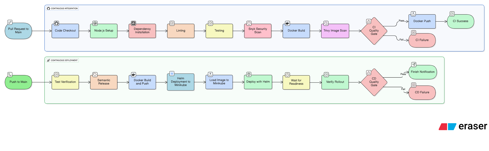

# Microservice CI/CD Pipeline

A robust CI/CD pipeline for a Node.js + TypeScript microservice, designed to showcase modern DevOps best practices. This project demonstrates automated build, test, containerization, security scanning, release management, and deployment to Kubernetes.



---

## Pipeline Overview

This repository implements a full CI/CD workflow, from code commit to deployment on a Kubernetes cluster (Minikube), leveraging the following tools and technologies:

- **GitHub Actions**: Orchestrates CI/CD workflows for both pull requests (CI) and main branch merges (CD).
- **ESLint**: Static code analysis to enforce code quality and style.
- **Jest**: Automated unit and integration testing for TypeScript code.
- **Snyk**: Security scanning for vulnerabilities in dependencies.
- **Trivy**: Container image vulnerability scanning.
- **Docker**: Containerization of the application for consistent deployment.
- **Semantic Release**: Automated versioning and changelog generation based on conventional commits.
- **Helm**: Kubernetes package management and templated deployment.
- **Minikube**: Local Kubernetes cluster for deployment validation.

---

## Pipeline Stages

### 1. Continuous Integration (CI) — Pre-Merge

Triggered on every pull request to the `main` branch:

- **Code Checkout**: Fetches the latest code from GitHub.
- **Node.js Setup**: Installs a consistent Node.js environment.
- **Dependency Installation**: Uses `npm ci` for clean, reproducible installs.
- **Linting**: Runs ESLint to enforce code standards.
- **Testing**: Executes Jest test suites for code correctness.
- **Snyk Security Scan**: Checks for known vulnerabilities in dependencies.
- **Docker Build**: Builds a Docker image tagged with the commit SHA.
- **Trivy Image Scan**: Scans the built Docker image for vulnerabilities.
- **Docker Push**: Pushes the image to Docker Hub if all checks pass.

See: [.github/workflows/ci.yml](.github/workflows/ci.yml)

---

### 2. Continuous Deployment (CD) — Post-Merge

Triggered on every push to the `main` branch:

- **Test Verification**: Runs the full test suite to ensure stability.
- **Semantic Release**: 
  - Analyzes commits for version bumps.
  - Publishes release notes and changelog.
  - Tags the repository with the new version.
- **Docker Build & Push**: 
  - Builds Docker images tagged with both the new version and `latest`.
  - Pushes images to Docker Hub.
- **Helm Deployment to Minikube**:
  - Spins up a Minikube Kubernetes cluster.
  - Loads the Docker image into Minikube.
  - Deploys the application using Helm charts ([helm-chart/](helm-chart/)).
  - Waits for deployment readiness and verifies rollout.
- **Finish Notification**: Marks the pipeline as complete.

See: [.github/workflows/cd.yml](.github/workflows/cd.yml)

---

## Getting Started

1. **Install dependencies:**
   ```sh
   npm install
   ```

2. **Run the service locally:**
   ```sh
   npm start
   ```

3. **Run tests:**
   ```sh
   npm test
   ```

4. **Build Docker image:**
   ```sh
   docker build -t user-service:latest .
   ```

5. **Deploy to Kubernetes (Minikube):**
   ```sh
   helm upgrade --install vois-explore ./helm-chart --set image.tag=latest
   ```

---

## Project Structure

- [`src/`](src/) — Application source code
- [`tests/`](tests/) — Jest test suites
- [`helm-chart/`](helm-chart/) — Helm deployment charts
- [Dockerfile](Dockerfile) — Multi-stage Docker build
- [.github/workflows/](.github/workflows/) — CI/CD pipeline definitions

---
